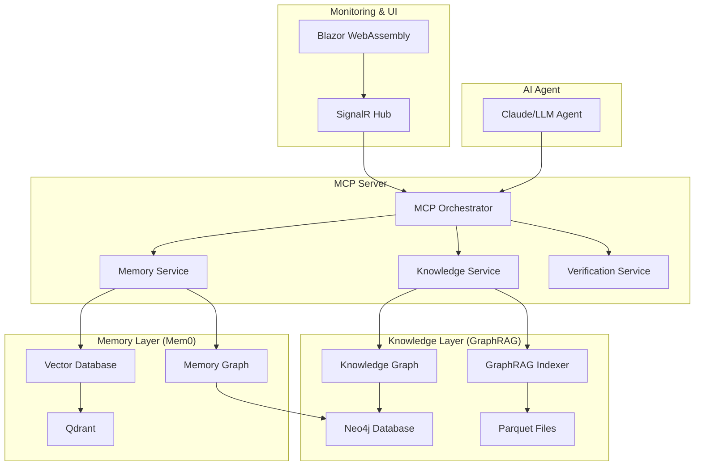

# System Architecture

## Overview
The advanced-memory-uniform50 system implements a sophisticated "Two Brains" architecture that combines GraphRAG's structured knowledge retrieval with Mem0's agentic memory layer, unified under the Model Context Protocol (MCP) framework.

## High-Level Architecture



## Core Components

### 1. MCP Server (Orchestration Layer)
**Purpose**: Central hub for agent-tool communication and service orchestration

**Responsibilities**:
- Tool registration and routing
- Request/response handling via Server-Sent Events
- Service lifecycle management
- Authentication and authorization
- Error handling and logging

**Key Features**:
- FastAPI-style endpoint design
- Streaming responses for real-time feedback
- Composite tool support for complex workflows
- Health monitoring and diagnostics

### 2. GraphRAG Knowledge Service
**Purpose**: Structured knowledge retrieval from document corpus

**Responsibilities**:
- Document ingestion and processing
- Entity and relationship extraction
- Knowledge graph construction
- Global and local search operations
- Community detection and summarization

**Architecture Pattern**: "Digital Library Expert"
- Maintains comprehensive, structured domain knowledge
- Optimized for deep, relational queries
- Static knowledge base updated through batch processes

### 3. Mem0 Memory Service
**Purpose**: Dynamic, personalized memory management

**Responsibilities**:
- User context storage and retrieval
- Conversation history management
- Preference and fact tracking
- Multi-user isolation
- Memory relationship mapping

**Architecture Pattern**: "Personal Assistant Memory"
- Evolves with each user interaction
- Personalized and contextual
- Dynamic updates in real-time

### 4. Verification Service
**Purpose**: Fact-checking and grounding layer

**Responsibilities**:
- Claim verification against trusted sources
- Temporal validation (recency checks)
- Confidence scoring
- Source attribution
- Hallucination detection

## Service Architecture Details

### MCP Server Implementation
```csharp
// Simplified service structure
public class MCPServer : IHostedService
{
    private readonly IKnowledgeService _knowledge;
    private readonly IMemoryService _memory;
    private readonly IVerificationService _verification;

    public async Task<ToolResponse> ExecuteTool(ToolRequest request)
    {
        return request.ToolName switch
        {
            "query_knowledge_base" => await _knowledge.QueryAsync(request.Parameters),
            "search_user_memory" => await _memory.SearchAsync(request.Parameters),
            "add_interaction_memory" => await _memory.AddAsync(request.Parameters),
            "grounding_check" => await _verification.VerifyAsync(request.Parameters),
            _ => throw new NotSupportedException($"Tool '{request.ToolName}' not found")
        };
    }
}
```

### GraphRAG Service Architecture
**Indexing Pipeline**:
1. Document chunking and preprocessing
2. LLM-based entity/relationship extraction
3. Graph construction in Neo4j
4. Community detection using Leiden algorithm
5. Community summarization generation

**Query Pipeline**:
1. Query analysis and routing (global vs. local)
2. Graph traversal and context retrieval
3. LLM-based response generation
4. Result caching and optimization

### Mem0 Service Architecture
**Memory Storage Model**:
- **Working Memory**: Session-specific context
- **Episodic Memory**: Conversation history
- **Factual Memory**: User preferences and facts
- **Semantic Memory**: Learned patterns and insights

**Hybrid Storage Backend**:
- Vector database (Qdrant) for semantic search
- Graph database (Neo4j) for relationship tracking
- Combined scoring: relevance + recency + importance

## Data Flow Architecture

### 1. Knowledge Query Flow
```
Agent Request → MCP Server → Knowledge Service → GraphRAG Engine → Neo4j/Parquet → Response Synthesis → Agent
```

### 2. Memory Operation Flow
```
Agent Request → MCP Server → Memory Service → Mem0 Engine → Qdrant/Neo4j → Processed Response → Agent
```

### 3. Composite Operation Flow
```
Agent Request → MCP Server → Orchestrator → [Parallel: Knowledge + Memory] → Synthesis → Verification → Agent
```

## Integration Patterns

### GraphRAG Integration Options

#### Option 1: Microsoft GraphRAG Library
```csharp
public class MicrosoftGraphRAGProvider : IGraphRAGProvider
{
    public async Task<string> QueryAsync(string query, SearchType type)
    {
        var command = new string[] {
            "python", "-m", "graphrag.query",
            "--root", _projectRoot,
            "--method", type.ToString().ToLower(),
            query
        };

        var result = await ProcessHelper.ExecuteAsync(command);
        return ParseResponse(result.Output);
    }
}
```

#### Option 2: Neo4j GraphRAG Library
```csharp
public class Neo4jGraphRAGProvider : IGraphRAGProvider
{
    private readonly IDriver _driver;
    private readonly GraphRAG _graphRAG;

    public async Task<string> QueryAsync(string query, SearchType type)
    {
        var retriever = new VectorCypherRetriever(_driver, _indexName, _retrievalQuery);
        return await _graphRAG.SearchAsync(query, retriever);
    }
}
```

### Mem0 Integration via REST Bridge
```csharp
public class Mem0RestProvider : IMemoryProvider
{
    private readonly HttpClient _httpClient;

    public async Task<MemorySearchResult> SearchAsync(string userId, string query)
    {
        var request = new MemorySearchRequest { UserId = userId, Query = query };
        var response = await _httpClient.PostAsJsonAsync("/memory/search", request);
        return await response.Content.ReadFromJsonAsync<MemorySearchResult>();
    }
}
```

## Scalability Architecture

### Horizontal Scaling Strategy
- **Stateless MCP Server**: Multiple instances behind load balancer
- **Database Sharding**: Neo4j cluster for graph data, Qdrant cluster for vectors
- **Caching Layer**: Redis for frequently accessed data
- **Event-Driven Updates**: Message queues for asynchronous processing

### Vertical Scaling Considerations
- **GPU Acceleration**: For embedding generation and LLM inference
- **Memory Optimization**: Graph database tuning for large knowledge bases
- **Connection Pooling**: Database connection management at scale

## Security Architecture

### Multi-Tenant Isolation
- **User ID-based data partitioning** in all services
- **Database-level access controls** for data isolation
- **API-level authentication** and authorization

### Data Protection
- **Encryption at rest** for sensitive user data
- **TLS/SSL** for all inter-service communication
- **API key management** for external service access
- **Audit logging** for compliance and monitoring

## Monitoring & Observability

### Metrics Collection
- **Request latency** and throughput per service
- **Database performance** metrics (query times, connection pools)
- **Memory usage** and resource utilization
- **Error rates** and exception tracking

### Real-Time Dashboard Components
1. **System Health**: Service status and availability
2. **Performance Metrics**: Response times and throughput
3. **User Activity**: Active sessions and operations
4. **Knowledge Base Status**: Indexing progress and graph statistics
5. **Memory System Status**: User memory counts and search performance

### Alerting Strategy
- **Performance degradation** alerts (> 2s response time)
- **Error rate spikes** (> 5% error rate)
- **Resource exhaustion** warnings (> 85% memory/CPU)
- **Service unavailability** critical alerts

## Deployment Architecture

### Local Development
```yaml
# docker-compose.yml structure
version: '3.8'
services:
  neo4j:
    image: neo4j:latest
    environment:
      - NEO4J_AUTH=neo4j/password

  qdrant:
    image: qdrant/qdrant

  mcp-server:
    build: ./src/AdvancedMemory.MCP
    depends_on: [neo4j, qdrant]

  blazor-frontend:
    build: ./src/AdvancedMemory.Frontend
    depends_on: [mcp-server]
```

### Production Deployment
- **Container orchestration** via Kubernetes
- **Managed databases** (Neo4j AuraDB, Qdrant Cloud)
- **Load balancing** with sticky sessions for SignalR
- **Auto-scaling** based on CPU/memory metrics
- **Blue-green deployments** for zero-downtime updates

## Design Principles

### 1. Separation of Concerns
Each service has a single, well-defined responsibility:
- Knowledge service: Domain expertise
- Memory service: User personalization
- MCP service: Protocol orchestration
- Verification service: Fact validation

### 2. Event-Driven Architecture
Services communicate via events for loose coupling:
- Knowledge updates trigger re-indexing
- Memory additions trigger relationship analysis
- User interactions trigger activity logging

### 3. Fail-Safe Operations
Graceful degradation when services are unavailable:
- Knowledge service fallback to cached responses
- Memory service fallback to session-only context
- Verification service optional for non-critical paths

### 4. Observable Systems
Every operation is traced and measured:
- Request/response logging with correlation IDs
- Performance metrics for all database operations
- User interaction analytics for system improvement

This architecture provides a robust, scalable foundation for building an advanced AI agent system that combines the best of structured knowledge retrieval and personalized memory management.